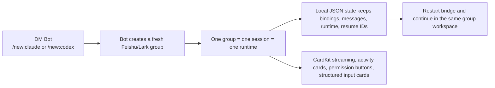

# agents-to-im

Feishu-first isolated session workspace for local AI coding agents.

DM creates a dedicated group-bound session space for Claude Code and Codex, while the real work stays in Feishu/Lark with recoverable local state and high-quality card streaming. Claude DM creation now starts with a mode-selection card before the group is created.

[中文](README.zh-CN.md)

---

`agents-to-im` is not just "Claude/Codex in chat". It turns Feishu/Lark into a control plane: DM is used to create a fresh workspace, the bot opens a new group, that group is bound to exactly one session and one runtime, and the bridge keeps the state locally so the workspace can survive bridge restarts.



## Why Feishu-first?

- **Dedicated session space, not mixed chat noise.** DM is only the control plane. `/new:claude` first asks for a Claude permission mode via card, then creates a fresh group; `/new:codex` creates the group directly. In both cases, the group is bound to exactly one session, so the working thread is isolated by default.
- **Recoverable local workspace.** Sessions, chat bindings, messages, runtime state, and resume identifiers live under `~/.agents-to-im/`, so restarting the bridge does not mean rebuilding the workspace model from scratch.
- **Feishu-native interaction, not plain text forwarding.** Streaming previews prefer CardKit, permission approvals prefer buttons, and activity/plan/structured-input flows are rendered as cards instead of reducing Feishu to a slash-command terminal.

## Support Snapshot

| Capability | Status |
| --- | --- |
| Claude Code runtime | Supported |
| Codex runtime | Supported |
| Feishu | Supported |
| Lark | Supported |
| DM control plane | `/new:claude`, `/new:codex` |
| Group-bound workspace | One group = one session = one runtime |
| Local recovery | Bindings, messages, runtime, status, resume IDs kept locally |
| Streaming preview | CardKit first, patch/text fallback |
| Permission approvals | Buttons first, `/perm` fallback |
| Activity and plan cards | Supported |
| Structured input cards | Supported when safe for chat input |
| Local dashboard | `http://127.0.0.1:3456` by default |

## Quick Start

### Prerequisites

- Node.js 20 or newer
- A Feishu/Lark custom app with Bot enabled
- Claude Code CLI installed and authenticated if you want Claude sessions
- `codex` CLI installed, authenticated, and supporting `codex app-server` if you want Codex sessions

### 1. Configure the Feishu/Lark app

1. Create a custom app on Feishu or Lark.
2. Enable the Bot capability.
3. Switch event delivery to `Long Connection`.
4. Add:
   - `im.message.receive_v1`
   - `card.action.trigger`
5. Grant enough scopes for:
   - receiving and reading IM messages
   - sending and updating IM messages
   - reading and updating chats
   - adding chat members
   - CardKit read/write
6. Publish the app after changing permissions or events.

For the full checklist, see [references/setup-guides.md](references/setup-guides.md).

### 2. Install and configure the bridge

If you want an AI coding agent to guide the setup, give it this prompt:

```text
Set up agents-to-im for this machine.
Read README.md and references/setup-guides.md, then guide me through:
1. Creating or checking the Feishu/Lark app
2. Filling ~/.agents-to-im/config.env
3. Verifying Claude Code and/or Codex local runtime availability
4. Starting the bridge and checking diagnostics
```

Manual install from source:

```bash
git clone https://github.com/francize/agents-to-im.git
cd agents-to-im
npm install
npm run build:all

mkdir -p ~/.agents-to-im
cp config.env.example ~/.agents-to-im/config.env
$EDITOR ~/.agents-to-im/config.env
```

You can also use the interactive setup wizard after building:

```bash
node dist/cli-bin.mjs
```

Required config:

- `CTI_DEFAULT_WORKDIR`
- `CTI_FEISHU_APP_ID`
- `CTI_FEISHU_APP_SECRET`

Common optional config:

- `CTI_DEFAULT_MODE`
- `CTI_FEISHU_DOMAIN`
- `CTI_FEISHU_ALLOWED_USERS`
- `CTI_CLAUDE_DEFAULT_MODEL`
- `CTI_CODEX_DEFAULT_MODEL`
- `CTI_CLAUDE_CODE_EXECUTABLE`
- `CTI_AUTO_APPROVE`
- `CTI_FEISHU_TOOL_OUTPUT_CARDS`
- `CTI_FEISHU_AUTO_IMAGE_SEND`

Codex sessions reuse your local `~/.codex/config.toml` or `$CODEX_HOME/config.toml` for auth, trusted directories, sandbox, approval policy, and default model behavior.

### 3. Start the bridge

```bash
node dist/cli-bin.mjs start
```

Useful local commands:

```bash
node dist/cli-bin.mjs status
node dist/cli-bin.mjs doctor
node dist/cli-bin.mjs logs 200
node dist/cli-bin.mjs stop
```

### 4. 5-minute validation

1. Run `node dist/cli-bin.mjs doctor`.
2. Run `node dist/cli-bin.mjs status` and confirm the bridge is running.
3. Open `http://127.0.0.1:3456` and confirm the local dashboard is reachable.
4. DM the bot with `/new:claude` or `/new:codex`.
5. For Claude, pick a mode from the card, then confirm the bot creates a fresh group, binds it to a new session, and replies inside that group.

## Feishu Experience

`agents-to-im` is designed to feel native in Feishu/Lark instead of behaving like a generic text relay.

| Experience | What happens |
| --- | --- |
| Streaming preview | The bridge primes a preview artifact, streams partial text through CardKit when available, then degrades to interactive-card patching and finally plain text only when needed |
| Permission handling | Inline buttons are the primary approval path; `/perm allow\|allow_session\|deny <id>` is only the fallback |
| Activity visibility | Command/file/plan activity is rendered as cards so the group sees progress without reading raw logs |
| Structured input | Runtime follow-up questions can be rendered as Feishu cards; sensitive prompts are kicked back to local CLI instead of leaking secrets to chat |
| Group naming | After the first successful turn, the bridge generates a short title and renames the group to match the session; Claude non-default permission modes are appended as a suffix like `[Plan Mode]` |

This gives Feishu a real workspace model: readable progress, fewer mobile-hostile commands, and better context continuity inside the group thread.

## State and Recovery

The bridge keeps state under `~/.agents-to-im/` so a group remains a recoverable workspace, not a disposable chat hook.

| Path | What it stores |
| --- | --- |
| `data/sessions.json` | Session metadata, runtime, model, title state, and resume-related metadata |
| `data/bindings.json` | Chat-to-session bindings, workdir, bridge mode, Claude permission mode, and model routing |
| `data/messages/` | Persisted message history per session |
| `runtime/status.json` | Bridge run status and last exit reason |
| `runtime/bridge.pid` | Active daemon PID for local process management |

What recovery means in practice:

- The group-to-session binding survives bridge restarts.
- Runtime choice survives, so the group remains Claude-backed or Codex-backed until you explicitly change it.
- Message history stays local to the workspace and can be reused by the bridge.
- Resume identifiers for SDK/runtime sessions are cached so future turns can continue the same underlying session when supported.
- `/reset` gives you a fresh session inside the same group while preserving the group's runtime model.

## Commands

### DM with the bot

| Command | Description |
| --- | --- |
| `/new:claude` | Open a Claude mode card, then create a new Claude-backed group workspace in the selected mode |
| `/new:codex` | Create a new Codex-backed group workspace |

Any other DM message returns help text instead of starting a session.

### In a bound group

| Command | Description |
| --- | --- |
| Normal message | Continue the current session |
| `/mode` | In Claude groups: open the Claude mode card. In Codex groups: use `/mode plan\|code\|ask` to switch bridge mode |
| `/plan` | Start an interactive planning flow |
| `/plan <request>` | Start planning immediately |
| `/reset` | Replace the current session and keep the group's runtime |
| `/perm allow\|allow_session\|deny <id>` | Fallback for permission approval |

## Compared with generic IM bridges

This project is intentionally opinionated about Feishu. Compared with generic IM bridges or broader multi-platform bridge designs:

| Dimension | Generic bridge pattern | agents-to-im |
| --- | --- | --- |
| Session model | The chat window itself often doubles as the session container | DM is only the control plane; the bot creates a fresh group as a dedicated workspace |
| Recovery model | Reconnect and continue if possible, but workspace state is often secondary | Bindings, messages, runtime state, and resume IDs are kept locally so the workspace can be recovered |
| Feishu interaction | Feishu is often treated as a text and command transport | CardKit streaming, activity cards, structured input cards, permission buttons, and group renaming are first-class behaviors |

The result is a better fit for teams that primarily work in Feishu/Lark and want a clean session boundary per task instead of a long-lived mixed command thread.

## Troubleshooting and References

- Bridge fails to start: run `node dist/cli-bin.mjs doctor`.
- Bot does not answer in DM: confirm the app is published, Bot is enabled, and Long Connection is configured.
- `/new:*` creates a group but fails to bind: check app scopes and local runtime availability.
- Streaming cards fall back to plain messages: verify CardKit and message update permissions.
- Permission buttons do nothing: verify `card.action.trigger` is configured and the updated app version has been published.

Reference docs:

- [references/setup-guides.md](references/setup-guides.md)
- [references/usage.md](references/usage.md)
- [references/token-validation.md](references/token-validation.md)
- [references/troubleshooting.md](references/troubleshooting.md)
- [SECURITY.md](SECURITY.md)

## Development

```bash
npm install
npm run typecheck
npm test
npm run build:all
```

## License

[MIT](LICENSE)
