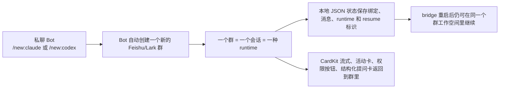

# agents-to-im

面向本地 AI 编码代理的 Feishu-first 隔离会话工作空间。

通过私聊创建专属群聊并绑定 Claude Code 或 Codex 会话，把正式协作留在 Feishu/Lark 里，同时保留可恢复的本地状态和高质量卡片流式体验。现在 Claude 的私聊创建会先弹出 mode 选择卡，再真正创建群聊。

[English](README.md)

---

`agents-to-im` 不只是“把 Claude/Codex 接到聊天里”。它把 Feishu/Lark 变成了控制面：私聊只负责创建工作空间，Bot 会自动拉起一个新群，这个群只绑定一个会话和一种 runtime，而 bridge 会把状态保存在本地，所以即使 bridge 重启，这个群也还是同一个可恢复的工作空间。



## 为什么这是 Feishu-first 方案？

- **它先创建隔离会话空间，而不是把聊天窗口直接当会话容器。** 私聊只是控制面。执行 `/new:claude` 后会先通过卡片选择 Claude mode，再创建新群；执行 `/new:codex` 则直接创建新群。两者都会绑定单个会话，默认就具备清晰的工作边界。
- **它的工作空间是本地可恢复的。** 会话、群绑定、消息、runtime 状态和 resume 标识都保存在 `~/.agents-to-im/` 下，bridge 重启后不需要重新理解“这个群现在对应哪个任务”。
- **它把 Feishu 当一等交互界面，而不是纯文本转发器。** 流式预览优先走 CardKit，权限优先走按钮，活动/计划/结构化提问优先走卡片，而不是把所有操作都压缩成 slash command。

## 支持概览

| 能力 | 状态 |
| --- | --- |
| Claude Code runtime | 已支持 |
| Codex runtime | 已支持 |
| Feishu | 已支持 |
| Lark | 已支持 |
| 私聊控制面 | `/new:claude`、`/new:codex` |
| 群绑定工作空间 | 一个群 = 一个会话 = 一种 runtime |
| 本地恢复 | 绑定、消息、runtime、状态、resume 标识都保存在本地 |
| 流式预览 | 优先 CardKit，失败后降级为 patch/text |
| 权限确认 | 优先按钮，`/perm` 兜底 |
| 活动卡 / 计划卡 | 已支持 |
| 结构化提问卡 | 聊天场景安全时支持 |
| 多 Bot profile | 已支持，按 runtime 映射到不同 Feishu/Lark Bot |
| 本地状态面板 | 默认 `http://127.0.0.1:3456` |

## 快速开始

### 前置条件

- Node.js 20 或更高版本
- 一个开启了 Bot 能力的 Feishu/Lark 自建应用
- 如果要创建 Claude 会话，需要本地已安装并认证 Claude Code CLI
- 如果要创建 Codex 会话，需要本地已安装并认证 `codex` CLI，且支持 `codex app-server`

### 1. 配置 Feishu/Lark 应用

1. 在 Feishu 或 Lark 开放平台创建自建应用。
2. 开启 Bot 能力。
3. 将事件分发方式切到 `Long Connection`。
4. 添加：
   - `im.message.receive_v1`
   - `card.action.trigger`
5. 权限配置优先使用飞书开放平台的“导入权限”能力，一次性导入 [references/setup-guides.md](references/setup-guides.md) 里的完整 scopes JSON。
6. 每次改权限或事件后，都重新发布应用版本，然后执行一次 `agents-to-im restart`。

完整检查清单见 [references/setup-guides.md](references/setup-guides.md)。

### 2. 安装并配置 bridge

如果你想让 AI 编码助手直接带着你完成安装，可以把下面这段 prompt 发给它：

```text
帮我在这台机器上配置 agents-to-im。
请先阅读 README.zh-CN.md 和 references/setup-guides.md，然后完成：
1. 安装持久可用的 agents-to-im CLI 命令
2. 检查或创建 Feishu/Lark 应用
3. 填写 ~/.agents-to-im/config.env
4. 验证 Claude Code 和/或 Codex 本地 runtime 是否可用
5. 启动 bridge 并检查诊断结果
```

源码 checkout 方式仅建议在你要开发或调试本项目时使用：

```bash
git clone https://github.com/francize/agents-to-im.git
cd agents-to-im
npm install
npm run build:all

mkdir -p ~/.agents-to-im
cp config.env.example ~/.agents-to-im/config.env
$EDITOR ~/.agents-to-im/config.env

# 修改配置或代码后的本地快速重启
bash scripts/daemon.sh restart
```

推荐安装流程：

```bash
npm install -g github:francize/agents-to-im
agents-to-im
```

日常维护统一使用安装后的 `agents-to-im` 命令：

```bash
agents-to-im start
agents-to-im restart
agents-to-im status
agents-to-im doctor
agents-to-im logs 200
agents-to-im stop
```

如果你只是想临时跑一次，`npx github:francize/agents-to-im` 仍然可用，但不再建议作为日常维护入口。

必填配置：

- `CTI_DEFAULT_WORKDIR`
- `CTI_FEISHU_PROFILE_IDS`
- `CTI_FEISHU_PROFILE_<ID>_APP_ID`
- `CTI_FEISHU_PROFILE_<ID>_APP_SECRET`
- `CTI_RUNTIME_CLAUDE_FEISHU_PROFILE`
- `CTI_RUNTIME_CODEX_FEISHU_PROFILE`

常见可选配置：

- `CTI_DEFAULT_MODE`
- `CTI_FEISHU_PROFILE_<ID>_DOMAIN`
- `CTI_FEISHU_PROFILE_<ID>_ALLOWED_USERS`
- `CTI_FEISHU_PROFILE_<ID>_TOOL_OUTPUT_CARDS`
- `CTI_FEISHU_PROFILE_<ID>_AUTO_IMAGE_SEND`
- `CTI_FEISHU_PROFILE_<ID>_LABEL`
- `CTI_CLAUDE_DEFAULT_MODEL`
- `CTI_CODEX_DEFAULT_MODEL`
- `CTI_CLAUDE_CODE_EXECUTABLE`
- `CTI_AUTO_APPROVE`

Codex 会话会直接复用本地 `~/.codex/config.toml` 或 `$CODEX_HOME/config.toml` 中的认证、trusted 目录、sandbox、approval policy 和默认模型行为。

单 Bot 最小示例：

```env
CTI_FEISHU_PROFILE_IDS=default
CTI_FEISHU_PROFILE_DEFAULT_APP_ID=cli_xxx
CTI_FEISHU_PROFILE_DEFAULT_APP_SECRET=xxx
CTI_RUNTIME_CLAUDE_FEISHU_PROFILE=default
CTI_RUNTIME_CODEX_FEISHU_PROFILE=default
CTI_DEFAULT_WORKDIR=/path/to/workdir
```

如果你要让 Claude 和 Codex 分别走不同 Bot，再新增一个 profile 并修改 runtime 映射即可，完整示例见 [references/setup-guides.md](references/setup-guides.md)。

### 3. 启动 bridge

```bash
agents-to-im start
```

常用本地命令：

```bash
agents-to-im restart
agents-to-im status
agents-to-im doctor
agents-to-im logs 200
agents-to-im stop
bash scripts/daemon.sh restart
```

修改 `config.env`、更新代码、或重新发布飞书事件 / 权限后，优先执行 `restart`，不要手工 `stop && start`。

### 4. 5 分钟验证

1. 运行 `agents-to-im doctor`
2. 运行 `agents-to-im status`，确认 bridge 正在运行
3. 打开 `http://127.0.0.1:3456`，确认本地状态面板可访问
4. 私聊 Bot，发送 `/new:claude` 或 `/new:codex`
5. 如果是 Claude，会先在私聊里选择 mode；随后确认 Bot 自动创建了一个新群、完成会话绑定，并在群里继续回复

## Feishu 体验

`agents-to-im` 的目标是在 Feishu/Lark 里提供原生工作空间体验，而不是做一个通用文本 relay。

| 体验点 | 实际行为 |
| --- | --- |
| 流式预览 | 先创建预览载体，优先通过 CardKit 持续更新局部内容；失败后降级为 interactive-card patch，必要时再退到普通文本 |
| 权限处理 | 按钮是默认确认路径，`/perm allow\|allow_session\|deny <id>` 只是兜底 |
| 活动可见性 | 命令、文件、计划等进度以卡片形式呈现，不要求群成员阅读原始日志 |
| 结构化提问 | runtime 的补充信息请求可以渲染成 Feishu 卡片；遇到敏感输入则明确退回本地 CLI，避免把 secret 发进群 |
| 群命名 | 首轮成功后，bridge 会生成短标题并尝试自动重命名群聊；Claude 的非默认 permission mode 会追加类似 `[Plan Mode]` 的后缀 |

这让 Feishu 里的工作体验更接近真正的协作空间：进度可见、移动端更友好、上下文也更稳定。

## 状态与恢复

bridge 会把状态保存在 `~/.agents-to-im/`，所以一个群是可恢复的工作空间，不是一次性聊天挂钩。

| 路径 | 保存内容 |
| --- | --- |
| `data/sessions.json` | 会话元数据、runtime、model、标题状态和 resume 相关信息 |
| `data/bindings.json` | 群聊到会话的绑定关系、工作目录、bridge 模式、Claude permission mode 和模型路由 |
| `data/messages/` | 按会话持久化的消息历史 |
| `runtime/status.json` | bridge 运行状态和最近退出原因 |
| `runtime/bridge.pid` | 当前 daemon PID，便于本地进程管理 |

这意味着：

- 群与会话的绑定关系在 bridge 重启后仍然存在
- runtime 选择会保留，群不会莫名从 Claude 变成 Codex 或相反
- 消息历史会留在本地工作空间里供 bridge 继续使用
- SDK/runtime 的 resume 标识会被缓存，后续回合在支持时可以续上同一个底层会话
- `/reset` 会在同一个群里创建全新会话，同时保留当前群的 runtime 模型

## 命令

### 私聊 Bot

| 命令 | 说明 |
| --- | --- |
| `/new:claude` | 先弹出 Claude mode 选择卡，再按所选 mode 创建新群工作空间 |
| `/new:codex` | 创建一个基于 Codex 的新群工作空间 |

私聊里发送其他内容时，Bot 只会返回帮助提示，不会直接启动会话。

### 绑定群内

| 命令 | 说明 |
| --- | --- |
| 普通消息 | 继续当前会话 |
| `/mode` | 在 Claude 群里弹出 Claude mode 卡片；在 Codex 群里仍可用 `/mode plan\|code\|ask` 切换 bridge 模式 |
| `/plan` | 进入交互式计划流程 |
| `/plan <需求>` | 直接开始生成计划 |
| `/stop` | 中断当前大模型输出，效果等价于在本地 CLI 里按一次 `Esc` / `Command+C` |
| `/reset` | 替换当前会话并保留群的 runtime |
| `/perm allow\|allow_session\|deny <id>` | 权限确认的兜底命令 |

## 相比通用 IM bridge 的差异

这个项目在 Feishu 维度上是刻意偏执的。相比通用 IM bridge 或更偏多平台广度的桥接方案：

| 维度 | 通用桥接模式 | agents-to-im |
| --- | --- | --- |
| 会话模型 | 常把当前聊天窗口直接当会话容器 | 私聊只是控制面，Bot 会新建一个群作为专属工作空间 |
| 恢复模型 | 重点是“能连上继续聊”，工作空间状态通常是次要的 | 绑定、消息、runtime 状态和 resume 标识都保存在本地，工作空间可以恢复 |
| Feishu 交互 | 往往把 Feishu 当成文本和命令传输层 | CardKit 流式、活动卡、结构化提问卡、权限按钮和群自动重命名都是一等能力 |

如果你的团队主要在 Feishu/Lark 里协作，并且希望每个任务都有清晰的会话边界，而不是把所有命令混进一个长期聊天线程里，这种模型会更自然。

## 排障与参考文档

- bridge 启动失败：先运行 `agents-to-im doctor`
- 私聊 Bot 没反应：检查应用是否已发布、Bot 是否已开启、长连接是否已配置
- `/new:*` 建了群但没有绑定成功：优先检查应用权限和本地 runtime 可用性
- 流式卡片退化成普通消息：检查 CardKit 和 message update 权限
- 权限按钮点击没反应：检查 `card.action.trigger` 是否已配置，且修改后的应用版本是否已重新发布

参考文档：

- [references/setup-guides.md](references/setup-guides.md)
- [references/usage.md](references/usage.md)
- [references/token-validation.md](references/token-validation.md)
- [references/troubleshooting.md](references/troubleshooting.md)
- [SECURITY.md](SECURITY.md)

## 开发

```bash
npm install
npm run typecheck
npm test
npm run build:all
```

## License

[MIT](LICENSE)
